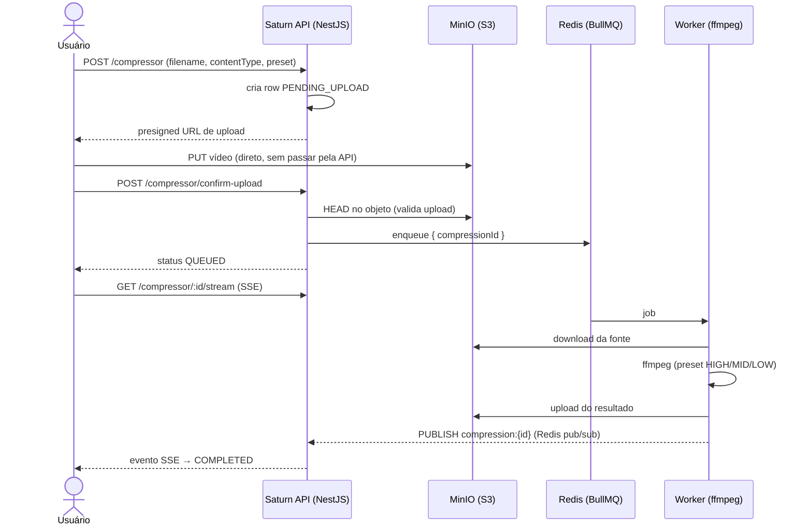

# Saturn/Squish API 🪐

> Control plane do **Squish**, um serviço de compressão de vídeo com upload direto pra object storage, fila de jobs e realtime status via SSE (Server-Sent-Events).

[](https://github.com/vitozaap/saturn-api/actions/workflows/deploy.yml)
[](https://github.com/vitozaap/saturn-api/actions/workflows/ci.yml)
[](https://github.com/vitozaap/saturn-api/commits)
[](https://www.typescriptlang.org/)
[](https://nestjs.com/)

O sistema é dividido em dois repositórios que se comunicam apenas por contratos (fila, banco e pub/sub):

| Repo | O que faz |
|------|-------|
| **saturn-api** (este) | Gerencia autenticação, presigned URLs, ciclo de vida das compressões, SSE |
| [saturn-compression-worker](https://github.com/vitozaap/saturn-compression-worker) | Consome a fila, roda ffmpeg, devolve o resultado |

## Arquitetura



**Decisões de arquitetura:**

- **Upload direto pro storage** Via presigned URL, evitando que o vídeo trafegue pela API. A API só emite a URL e valida depois (`HEAD`).
- **Status em tempo real sem polling** usando SSE. O worker publica num canal Redis (`compression:{id}`); a API mantém um stream SSE aberto e repassa cada transição.
- **Idempotência na fila** — `jobId = compressionId` deduplica enqueue; o worker "pega" o job com `UPDATE ... WHERE status IN ('QUEUED','PROCESSING')`, então entregas duplicadas são no-op.
- **Dois Redis** — BullMQ consome muitos comandos, então roda num Redis em um container na VPS; o pub/sub de status usa Upstash, já que consome bem menos.
- **Ciclo de vida:** `PENDING_UPLOAD → QUEUED → PROCESSING → COMPLETED | FAILED`.

## Tecnologias

| Camada | Stack |
|--------|-------|
| Framework | [NestJS](https://nestjs.com/) (Node.js, TypeScript strict) |
| Banco | PostgreSQL ([Neon](https://neon.tech/)) via [Prisma 7](https://www.prisma.io/) |
| Autenticação | [better-auth](https://www.better-auth.com/) (sessões anônimas, adapter Prisma) |
| Fila | [BullMQ](https://docs.bullmq.io/) (producer) + Redis |
| Object storage | [MinIO](https://min.io/) — S3-compatible, AWS SDK v3 + presigned URLs |
| Tempo real | Server-Sent Events (RxJS `Observable`) + Redis pub/sub |
| Docs de API | Swagger (OpenAPI) + [Scalar](https://scalar.com/) em `/reference` |
| Observabilidade | [Sentry](https://sentry.io/) |
| Testes | [Vitest](https://vitest.dev/) (unit, rodando no CI em ARM) |
| Deploy | Docker multi-stage → [ghcr.io](https://ghcr.io) → VPS ARM via GitHub Actions |

## Endpoints

Documentação completa em **`/reference`** (Scalar) com o schema do better-auth incluído.

| Método | Rota | Descrição |
|--------|------|-----------|
| `POST` | `/compressor` | Cria a compressão e retorna a presigned URL de upload |
| `POST` | `/compressor/confirm-upload` | Valida o upload no storage e enfileira o job |
| `GET` | `/compressor` | Lista as compressões do usuário autenticado |
| `GET` | `/compressor/:id/stream` | **SSE** Emite o estado a cada transição, fecha em `COMPLETED`/`FAILED` |
| `*` | `/api/auth/*` | Rotas do better-auth (sessão anônima, etc.) |

## Modelo de dados

Tabela `Compression` carrega o ciclo de vida inteiro (fonte → job → resultado):

- `id` usando `uuidv7()` (ordenável por tempo); `sourceKey` (único) é o link objeto↔row.
- Tamanhos usando `BigInt`, pois vídeo passa fácil de 2 GB, `Int` não aguentaria.
- Taxa de compressão é **derivada** (`outputSize / sourceSize`), nunca armazenada.
- `preset` (`HIGH | MID | LOW`) escolhido no request, executado pelo worker.

## Rodando localmente

Pré-requisitos: Node 24+, Docker.

```bash
# 1. Dependências
npm ci

# 2. Infra local (Postgres/MinIO/Redis)
docker compose -f compose.dev.yml up -d

# 3. Configura o ambiente
cp .env.example .env   # preencha as variáveis

# 4. Prisma
npm run db:generate
npm run db:migrate

# 5. Sobe em watch mode
npm run start:dev      # http://localhost:3000 docs em /reference
```

Testes:

```bash
npm run test        # vitest run
npm run test:cov    # tests + coverage
```

## Deploy

Push na `main` dispara o pipeline (`.github/workflows/deploy.yml`):

1. Build da imagem (multi-stage, ARM64) e push pro **ghcr.io**.
2. Migrations do Prisma rodam **apenas** quando `prisma/migrations/**` muda (ou manualmente se precisar).
3. SSH na VPS → `docker compose pull && up`.

Os composes de API, worker e fila são separados e se comunicam pela rede Docker externa `saturn-net`. O MinIO tem lifecycle rule que expira uploads brutos em 1 dia (permanece somente o resultado comprimido).

## Referências

- [BullMQ — patterns de retry e idempotência](https://docs.bullmq.io/guide/retrying-failing-jobs)
- [Presigned URLs — AWS S3](https://docs.aws.amazon.com/AmazonS3/latest/userguide/PresignedUrlUploadObject.html)
- [Server-Sent Events — MDN](https://developer.mozilla.org/en-US/docs/Web/API/Server-sent_events)
- [Prisma 7 — driver adapters](https://www.prisma.io/docs/orm/overview/databases/database-drivers)
- [better-auth — anonymous plugin](https://www.better-auth.com/docs/plugins/anonymous)
